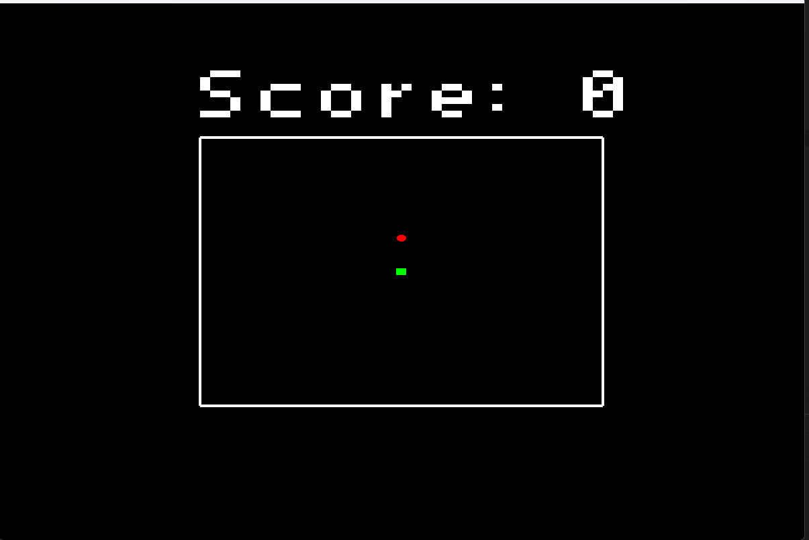
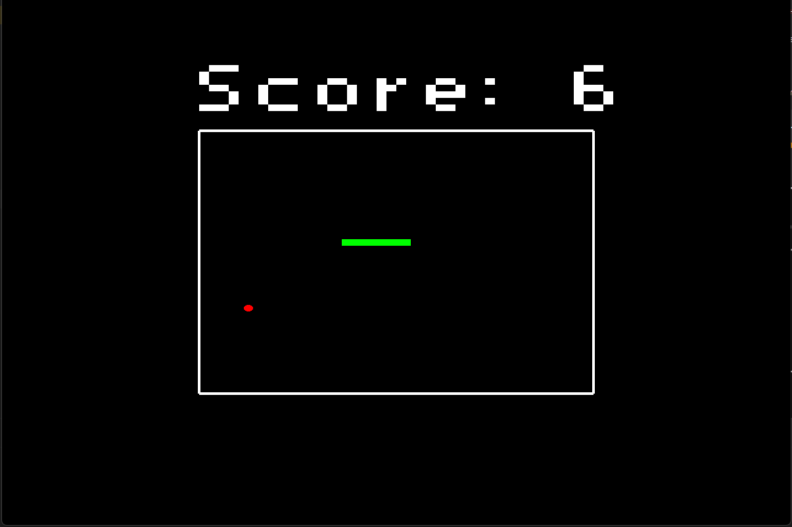

# 🐍 Snake Game - OpenGL em C++

Este é um projeto do jogo da cobrinha (Snake) desenvolvido em **C++** com uso de **OpenGL** e **GLFW** para renderização gráfica. O objetivo é simples: conduza a cobrinha por um cenário 2D, consuma os alimentos e evite colidir com as bordas ou com o próprio corpo!

---

## 🎯 Objetivo do Projeto

- Praticar conceitos fundamentais de **Computação Gráfica**;
- Aplicar a biblioteca **OpenGL** para renderização 2D;
- Desenvolver lógica de movimentação, colisão e pontuação;
- Modularizar o código com uso de POO (Programação Orientada a Objetos) em C++;
- Ter uma estrutura base para jogos simples em C++.

---

## ⚙️ Tecnologias Utilizadas

- `C++`
- `OpenGL`
- `GLFW`
- `STB Easy Font` (para renderizar pontuação)

---

## 🧱 Estrutura de Arquivos

- `main.cpp`: ponto de entrada do jogo;
- `Game.cpp / Game.h`: gerencia as regras principais, estados e fluxo do jogo;
- `Snake.cpp / Snake.h`: representa a lógica da cobrinha, movimentação e colisões;
- `Food.cpp / Food.h`: controle do alimento e sua renderização;
- `Renderer.cpp / Renderer.h`: configurações de renderização e janela;
- `Makefile` (opcional): pode ser adicionado para facilitar a compilação via terminal.

---

## 🕹️ Como Jogar

### Controles
- `↑ ↓ ← →` — Movimentar a cobrinha.
- `W A S D` — Movimentar a cobrinha.

### Regras
- Comer a comida verde para crescer e aumentar a pontuação;
- Se bater nas bordas ou em si mesma: **Game Over**;
- O jogo reinicia automaticamente após colisão.

---

## 🔧 Requisitos para Executar

### Dependências
- `GLFW` instalado (versão recomendada: 3.3+);
- `OpenGL` configurado no ambiente;
- Compilador `g++` com suporte à C++17 ou superior.

### Compilação
Você pode compilar o projeto com o seguinte comando:

```bash
g++ main.cpp Game.cpp Renderer.cpp Snake.cpp Food.cpp -o snake -lglfw -lGL -lGLU
```

### Imagens do Jogo


